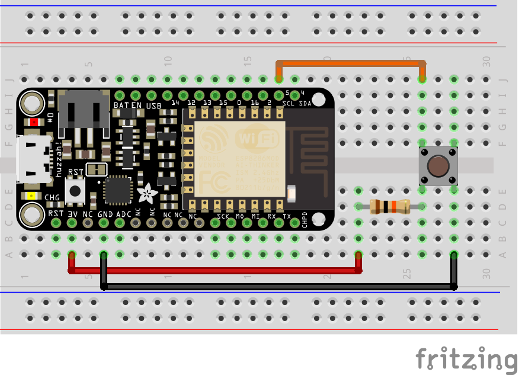
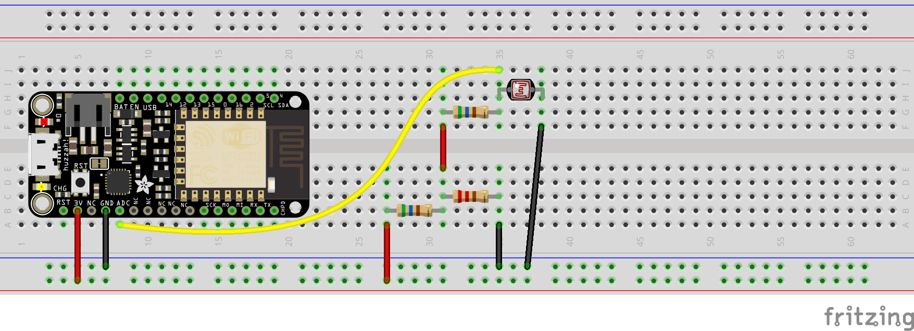
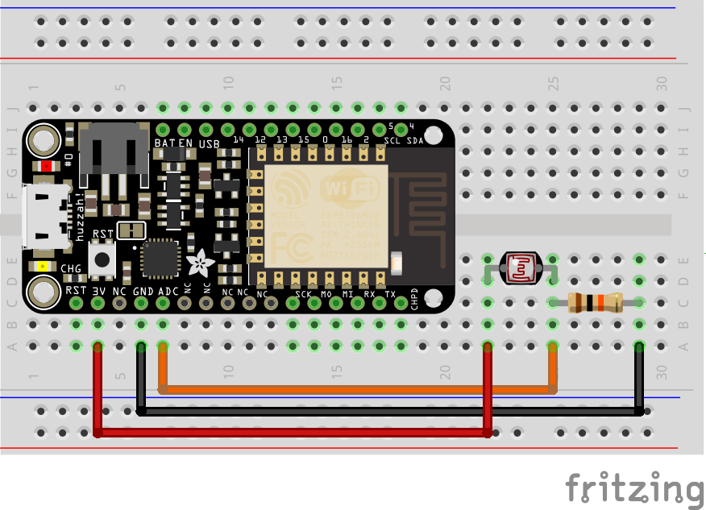

# HCDE-440-2.2-Adafruit-IO

The code sends analog values to Adafruit IO froma photocell and digital values from a button. Here is the link to my Adafruit.io [dashboard](https://io.adafruit.com/LuffyWesley/dashboards/analog) that houses feeds for both button and photocell.

## Schematic 
### Button

### PhotoCell Complicated ([Voltage Divider Calulator](http://www.ohmslawcalculator.com/voltage-divider-calculator))

### PhotoCell Simplified

## Tutorials Followed
1. [Analog Input](https://learn.adafruit.com/adafruit-io-basics-analog-input/overview-uniontownlabs)
2. [Digital Input](https://learn.adafruit.com/adafruit-io-basics-digital-input/overview)